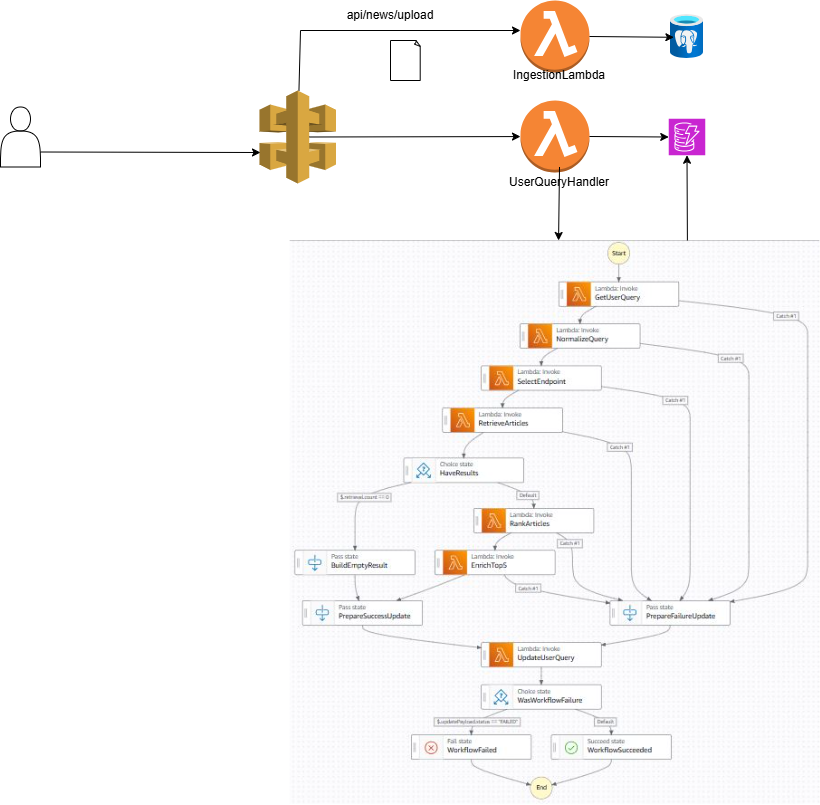

# Project

This is a demo Project for Inshorts. 

## Requirements

### Functional Requirements

1. **LLM-based query understanding**
   - Process the user’s news query using a publicly available LLM API.
   - Extract relevant entities, concepts, and user intent from the query.
   - Use the extracted intent to choose the most appropriate retrieval strategy.

2. **News data ingestion**
   - Load the provided news article JSON data into a database.
   - Support storage in either SQL or NoSQL.

3. **Supported retrieval modes**
   - **category**: fetch articles for a specific category
   - **score**: fetch articles above a relevance score threshold
   - **search**: fetch articles using text search over title and description
   - **source**: fetch articles from a specific source
   - **nearby**: fetch articles within a given radius of the user’s location

4. **Ranking logic**
   - **category** and **source** results are ranked by publication date, most recent first
   - **score** results are ranked by relevance score, highest first
   - **search** results are ranked using a combination of relevance score and text match quality
   - **nearby** results are ranked by distance from the user’s location

5. **Result enrichment**
   - Enrich returned articles with an LLM-generated summary

6. **Response format**
   - Return the top 5 most relevant articles
   - Use a consistent JSON structure across all retrieval modes
   - Each article should include:
     - title
     - description
     - url
     - publication_date
     - source_name
     - category
     - relevance_score
     - llm_summary
     - latitude
     - longitude

### API Design Requirements

- Follow RESTful API design principles
- Use versioned endpoints such as `/api/v1/news`
- Accept user inputs through query parameters
- For nearby search, accept `lat`, `lon`, and `radius`
- Return proper HTTP status codes and informative error messages
- Optionally include metadata such as total results, page number, and query used

## High Level Design

### User Facing APIs:

1. For uploading news with a file:
https://y0lm8uatmc.execute-api.us-west-2.amazonaws.com/prod/api/v1/news/upload

POST Method, add news data as file

2. For User querying news:
https://y0lm8uatmc.execute-api.us-west-2.amazonaws.com/prod/api/v1/news/user_query

Post Method 
Sample Body/Payload:
{
    "queryText" : "Top news on AI"
    "userId" : "userId-xyxz"
}

Response
{
   "queryId" : "awcawef-cw12121-aw3ed23d"
}

3. For User querying status:
https://y0lm8uatmc.execute-api.us-west-2.amazonaws.com/prod/api/v1/news/user_query_status
GET Query Params:
{
   "queryId": "awcawef-cw12121-aw3ed23d"
}

Response:
{
   "status": "IN_PROCESS/FINISHED/FAILED",
   
   "status": {
      statusCode: 200/500,
      "result": {},
      "error": {}
   }
}

Post Method 
Sample Body/Payload:
{
    "queryText" : "Top news on AI"
    "userId" : "userId-xyxz"
}

###Simulated APIs/Internal Facing

1. https://y0lm8uatmc.execute-api.us-west-2.amazonaws.com/prod/api/v1/news/upload

2. 

